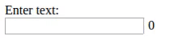

# chrome-extension-example

Simple Chrome extension that adds bytes counter next to a textbox in a given HTML page.

#### Installation

* Clone the repo
* Go to `chrome://extensions`
* Click "Load unpacked extension..."
* Select "plugin" directory form this project

Now open `test_page.html`, and you should see a counter next to the textbox. If you disable the plugin, the counter will not be shown.
